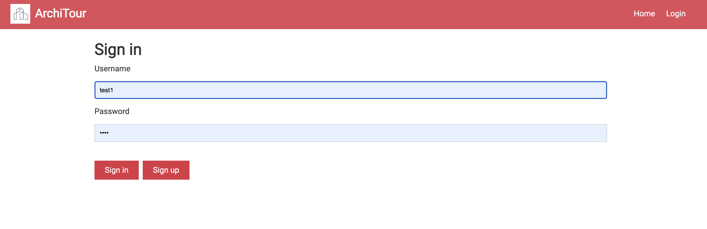
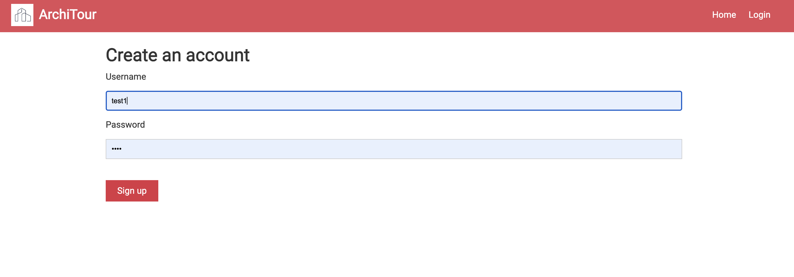
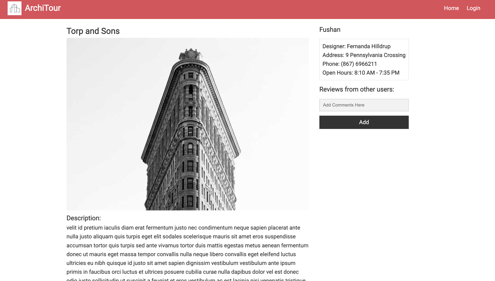
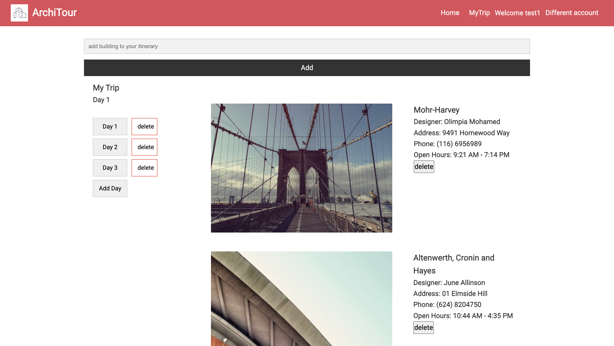
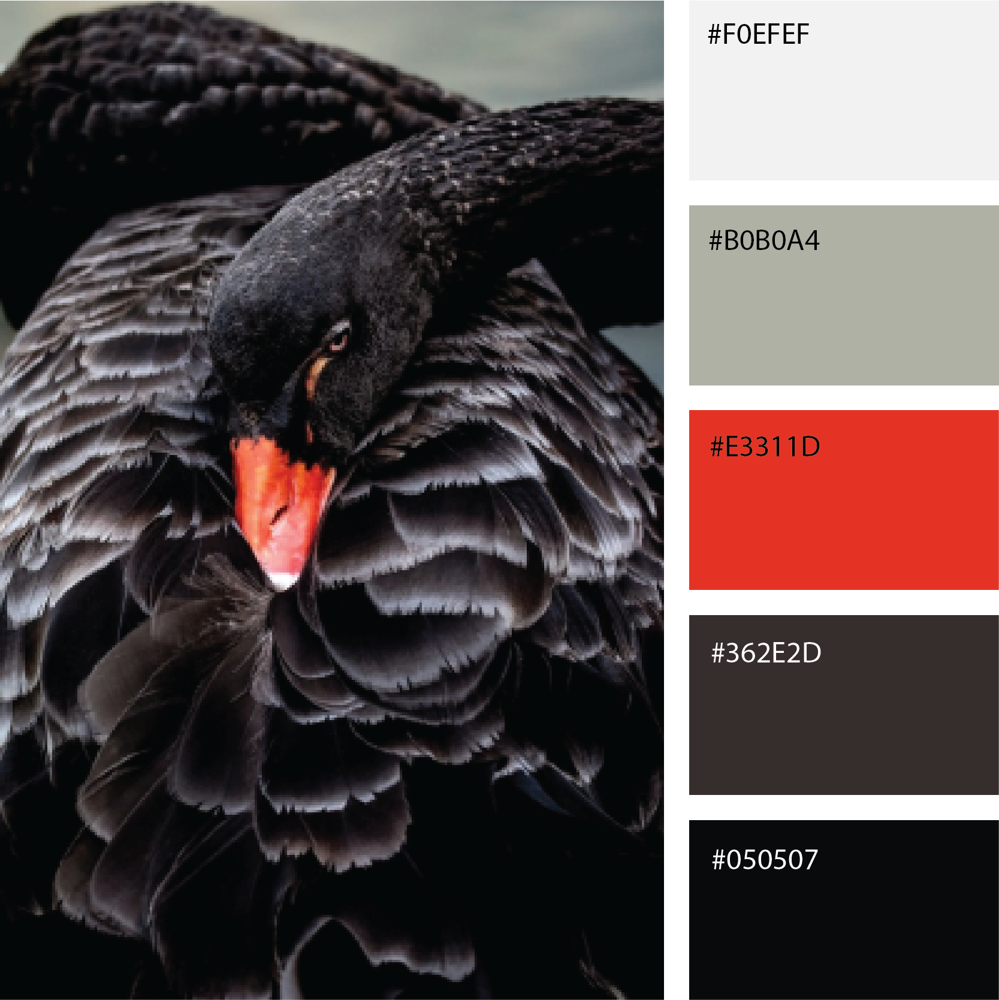

# **ArchiTour**
I love this travelling app design, and all the code is well-structure in the folder. It frontend it well connected to backend and store signin data to  MongoDB and show to fronted. And I also love the idea of planning days and add trip, so users can set up plan in order while they facing tons of places they want to go. In the future or next project, you may add calendar function so that user can access to it on specific day, which is even more user friendly:) Overall, Good Job!

### 60% CheckPoint

 [Nov15 60% release link](https://github.com/Xingjian-Bi/ArchiTour/releases/tag/60%25)

 [Nov15 60% repo history link](https://github.com/Xingjian-Bi/ArchiTour/tree/4f5f275b94f383b8252288653d625c7fb96807bc)


### 80% CheckPoint

 [Nov22 80% release link](https://github.com/Xingjian-Bi/ArchiTour/releases/tag/80%25)

 [Nov22 80% repo history link](https://github.com/Xingjian-Bi/ArchiTour/tree/490120eb65f28109b1e14b497ef99e6a07f5cf53)


### [Final Release Link](https://github.com/Xingjian-Bi/ArchiTour/releases/tag/final_ver)


### Objective

This is project3 for NEU [CS5610](https://johnguerra.co/classes/webDevelopment_fall_2022/).   We build a full stack application with Node + Express + Mongo + React (hooks). Architour is a travel app specially designed for architecture lovers. It allows users to find interesting architecture in cities, check out their information or read other people’s reviews. Users can create multi-day itinerary and add stops from existing architecture collections. 


### Author

[Xingjian Bi](https://github.com/Xingjian-Bi) & [Yi Zhou](https://github.com/HotdrynoodlesTauren)


### Slides & Video & Design Document & Deployment Link

[Slides Here](https://docs.google.com/presentation/d/1zne3HRTQPDRAu650DZ58_x2izV387ufvwrgc-LbzDTM/edit#slide=id.g17b3cadc138_0_5)

[Video Here](https://youtu.be/r8_uVI29qes)

[Delpoyed Here](https://architour-back.onrender.com)

[Design Document Here](https://github.com/Xingjian-Bi/ArchiTour/blob/main/ArchiTour%20Design%20Document.pdf)


### Instructions to Build Locally

- Download/clone this project to your loacal device.

- Create a .env file and set your `MONGO_URL` variable. 

- Download [architectures data](https://drive.google.com/file/d/1Iq1a5lrDvLrbNB2OUhjN-ENPlv0n9RD5/view?usp=sharing) and import to your mongodb database. 

- Use following command to import the data. (need mongodb installed locally)

  ```
  mongoimport --uri {your mongodb credentials} --collection architectures --type CSV --file MOCK_DATA2.csv --headerline
  ```

- Perfrom folowing command on the root directory of this project

  ```
  yarn install
  yarn start
  cd front
  yarn install
  yarn start
  ```

- Go to [http://localhost:3000]( http://localhost:3000)  to visit our site! 


### Screenshot (V1.0)










### Screenshot (V2.0)

### Color Palette


Since we are happy about and our original design and we received positive feedback about our colors from some users, we decided to stick to our original red color, however we did search for color palettes and found the above one that fits our site most and made some small changes according to it.
<br>
The new red #E3311D is a little bit more bright than the original one, we also changed our navbar font color to balck just to increase contrast which is better for accessability.
<br>
We used dark grey #362E2D and light grey #F0EFEF for our buttons instead of the original red ones, we used #050507 which is slightly lighter than black for our alert(to differentiate from our main red color) and text, and the olive-grey is for some text placeholder.  

### Fonts

We have decided that we need to express a delightful and modern feeling for our travl application, we need to use a vivid and cheerful fonts,
Among many sans-serif fonts, we have chonsen 'Archivo'.  

